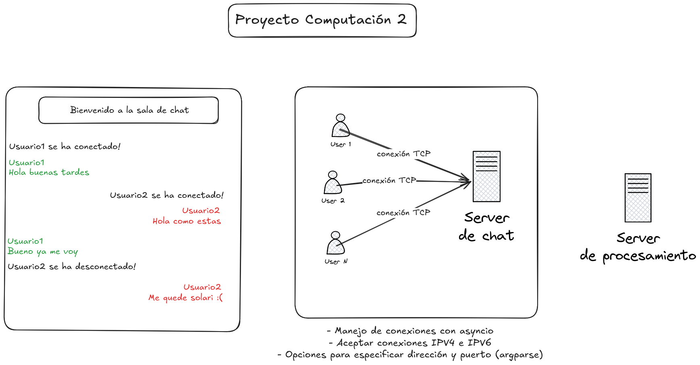

# 🧑‍💻 Sala de Chat Asíncrona (IPv4 + IPv6) Proyecto Final Computación2

Este proyecto es una sala de chat implementada en Python como parte del trabajo final para la asignatura **Computación 2**. El objetivo principal es permitir que múltiples clientes, conectados utilizando **IPv4 o IPv6**, puedan comunicarse de forma simultánea mediante un servidor central programado usando `asyncio`.

---

## 📌 Características

- ✅ Soporte de conexiones **IPv4 e IPv6**
- ✅ Programación **asíncrona** con `asyncio`
- ✅ Manejo de múltiples clientes en paralelo
- ✅ Difusión de mensajes entre clientes conectados
- ✅ Configuración del servidor por línea de comandos

---

## 🧠 Arquitectura



## 🚀 Cómo ejecutar el servidor

1. **Cloná el repositorio:**

   ```bash
   git clone https://github.com/tomasgrau2/Proyecto-Final-Computacion-2.git
   cd Proyecto-Final-Computacion-2
   $ python3 servidor.py


## 🧪 Ejemplo de uso

```bash
# 1) Levantás el servidor:
$ python3 servidor.py
Servidor escuchando en IPv6 (::) y IPv4 (0.0.0.0) en el puerto 8888

# 2) Cliente A se conecta por IPv6:
$ telnet ::1 8888
Trying ::1...
Connected to localhost.
Escape character is '^]'.
¡Hola desde IPv6!

# 3) Cliente B se conecta por IPv4:
$ telnet 127.0.0.1 8888
Trying 127.0.0.1...
Connected to localhost.
Escape character is '^]'.
Hola desde IPv4 también

# 4) Salida completa en la consola del servidor:
Servidor escuchando en IPv6 (::) y IPv4 (0.0.0.0) en el puerto 8888
Cliente conectado: ('::1', 55642, 0, 0)
📨 Mensaje de ('::1', 55642, 0, 0): ¡Hola desde IPv6!
Cliente conectado: ('127.0.0.1', 42010)
📨 Mensaje de ('127.0.0.1', 42010): Hola desde IPv4 también
